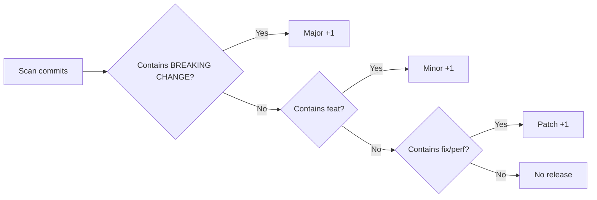

# Commit Message Convention (Conventional Commits)

> 🇨🇳 [中文版](./CONTRIBUTING_ZH.md)

This project follows the [Conventional Commits](https://www.conventionalcommits.org/en/) specification.  
Combined with [Semantic Versioning (SemVer)](https://semver.org/), it enables **automated version management** and **automatic CHANGELOG generation**.

---

## 1. Commit Message Format

```
<type>(<scope>): <subject>

<body>

<footer>
```

| Part | Required | Description |
|------|----------|-------------|
| `type` | ✅ Required | Commit type, determines how the version number changes |
| `scope` | ⬜ Optional | Affected scope (module name), e.g. `parser`, `renderer`, `app` |
| `subject` | ✅ Required | Brief description, max 72 characters, **no period** |
| `body` | ⬜ Optional | Detailed explanation of "why" and "how" |
| `footer` | ⬜ Optional | Related Issues, Breaking Change notes, etc. |

---

## 2. Type Quick Reference

### 2.1 Types That Affect Version Number

| Type | Description | SemVer Impact | Example |
|------|-------------|---------------|---------|
| `feat` | ✨ **New Feature** | Bumps Minor (x.**Y**.0) | Add new Markdown syntax support |
| `fix` | 🐛 **Bug Fix** | Bumps Patch (x.y.**Z**) | Fix parser crash issue |
| `perf` | ⚡ **Performance** | Bumps Patch (x.y.**Z**) | Optimize streaming parse performance |

### 2.2 Types That Do NOT Affect Version Number

| Type | Description | Example |
|------|-------------|---------|
| `docs` | 📝 Documentation changes | Update README, PARSER_COVERAGE_ANALYSIS |
| `style` | 💄 Code formatting (no logic change) | Fix indentation, remove extra blank lines |
| `refactor` | ♻️ Refactor (neither bug fix nor new feature) | Refactor InlineParser architecture |
| `test` | ✅ Test related | Add unit tests, fix tests |
| `build` | 🔧 Build system / dependency changes | Upgrade Gradle, update Kotlin version |
| `ci` | 👷 CI/CD configuration | Modify GitHub Actions workflow |
| `chore` | 🔨 Miscellaneous | Update .gitignore, IDE config |
| `revert` | ⏪ Revert commit | Revert an erroneous commit |

### 2.3 Breaking Change (Major Version Bump)

Add `BREAKING CHANGE:` in the footer or append `!` after the type to trigger a **Major version bump** (**X**.0.0):

```
feat(parser)!: restructure AST node hierarchy

BREAKING CHANGE: MarkdownNode interface signature has changed, all custom nodes need to adapt to the new interface.
```

---

## 3. Commit Examples by Scenario

### 3.1 ✨ New Feature (feat)

```bash
# Basic format
git commit -m "feat(parser): add definition list syntax parsing"

# Detailed format with scope
git commit -m "feat(renderer): implement table rendering support

Support full rendering of GFM table syntax, including left-align,
right-align, center-align, and inline elements within cells.

Closes #18"

# Multi-module changes
git commit -m "feat: add admonition block support

- parser: add BlockQuote → Admonition conversion logic
- renderer: implement NOTE/TIP/WARNING style rendering
- app: add admonition preview sample to Demo page

Closes #25"
```

### 3.2 🐛 Bug Fix (fix)

```bash
# Basic format
git commit -m "fix(parser): fix stack overflow when parsing nested blockquotes"

# With detailed description
git commit -m "fix(renderer): fix inline code invisible in dark theme

Inline code background color was too similar to dark theme background,
making text invisible. Set distinct background and foreground colors
for each theme mode.

Fixes #14"

# Build issue fix
git commit -m "fix(build): Maven repository config causes Gradle sync failure"
```

### 3.3 ⚡ Performance (perf)

```bash
git commit -m "perf(parser): optimize incremental parsing performance

Reuse stable prefix blocks directly, incrementally re-parse only
the dirty tail region. Reduces large document parse time by ~40%."

git commit -m "perf(renderer): cache TextStyle instances to avoid repeated creation"
```

### 3.4 ♻️ Refactor (refactor)

```bash
git commit -m "refactor(renderer): decouple InlineRenderer into a standalone module"

git commit -m "refactor(parser): switch StreamingParser to append-only incremental strategy

Change streaming parse from full re-parse to tail-only incremental parsing,
eliminating redundant AST reconstruction."
```

### 3.5 📝 Documentation (docs)

```bash
git commit -m "docs: update README with installation instructions"

git commit -m "docs(parser): update PARSER_COVERAGE_ANALYSIS to mark newly supported syntax"
```

### 3.6 ✅ Tests (test)

```bash
git commit -m "test(parser): add unit tests for custom container syntax"

git commit -m "test(renderer): add edge case tests for table rendering"
```

### 3.7 🔧 Build / Dependencies (build)

```bash
git commit -m "build: upgrade Kotlin to 2.1.0"

git commit -m "build: update Compose Multiplatform to 1.7.3

Also update gradle.properties and libs.versions.toml."
```

### 3.8 🔖 Release (chore/release)

```bash
git commit -m "chore(release): release v1.3.0"

git commit -m "chore(release): bump version to 1.2.5"
```

### 3.9 ⏪ Revert (revert)

```bash
git commit -m "revert: feat(parser): add definition list syntax parsing

This reverts commit abc1234.
Reason: This feature has compatibility issues on iOS and needs further investigation."
```

---

## 4. Scope Reference

The following scopes are recommended for this project:

| Scope | Module | Description |
|-------|--------|-------------|
| `parser` | `markdown-parser` | Markdown parser (AST generation) |
| `renderer` | `markdown-renderer` | Rendering engine (AST → Compose UI) |
| `app` | `composeApp` | Compose Multiplatform Demo application |
| `android` | `androidapp` | Android standalone application |
| `ios` | `iosApp` | iOS application |
| `build` | Root project build | Gradle config, dependency management |

> If changes span multiple modules, you may omit the scope and describe each module's changes in the body.

---

## 5. New Feature Development Guidelines

### 5.1 Development Checklist

When developing a new feature, please verify the following:

- [ ] Parsing logic implemented in `markdown-parser`
- [ ] Corresponding unit tests added in `markdown-parser` (`commonTest`)
- [ ] Rendering logic implemented in `markdown-renderer` (if rendering is involved)
- [ ] Corresponding unit tests added in `markdown-renderer` (if rendering is involved)
- [ ] `./gradlew allTests` passes successfully
- [ ] Preview sample added to `composeApp` Demo page
- [ ] Updated `markdown-parser/PARSER_COVERAGE_ANALYSIS.md` support list

### 5.2 Running Tests

```bash
# Parser module tests
./gradlew :markdown-parser:allTests

# Renderer module tests
./gradlew :markdown-renderer:allTests

# All tests
./gradlew allTests
```

- Gradle task exit code must be `0`
- Console output must show "BUILD SUCCESSFUL"
- **Never** commit code with failing tests

### 5.3 Test Writing Guidelines

- **Test file location**: `<module>/src/commonTest/kotlin/com/hrm/markdown/...`
- **Test class naming**: `FeatureNameTest` (e.g. `HeadingParserTest`, `TableRendererTest`)
- **Test method naming**: `should_expectedBehavior_when_condition` or a clear description of the test purpose
- **Coverage requirements**:
  - ✅ Happy Path — verify functionality works under standard input
  - ✅ Edge Cases — empty input, special characters, nested structures, etc.
  - ✅ Error Handling — graceful degradation on invalid input

---

## 6. MR (Merge Request) Guidelines

### 6.1 MR Title Format

MR titles should follow the same Conventional Commits format as commit messages:

```
<type>(<scope>): <short description>
```

**Examples:**

| Scenario | MR Title |
|----------|----------|
| New Feature | `feat(parser): add custom container syntax support` |
| Bug Fix | `fix(renderer): fix nested list rendering indent issue` |
| Performance | `perf(parser): optimize incremental parsing for large documents` |
| Refactor | `refactor(renderer): unify block node rendering path` |
| Release | `chore(release): v1.3.0` |
| Multi-feature | `feat: add admonition, footnote, and definition list support` |

### 6.2 MR Description Template

```markdown
## Summary
<!-- Briefly describe what this MR does -->

## Change Type
- [ ] ✨ New Feature (feat)
- [ ] 🐛 Bug Fix (fix)
- [ ] ♻️ Refactor (refactor)
- [ ] ⚡ Performance (perf)
- [ ] 📝 Documentation (docs)
- [ ] ✅ Tests (test)
- [ ] 🔧 Build/CI (build/ci)

## Affected Modules
- [ ] markdown-parser
- [ ] markdown-renderer
- [ ] composeApp
- [ ] androidapp / iosApp

## Self-Test Checklist
- [ ] `./gradlew allTests` all passed
- [ ] Unit tests added for new functionality
- [ ] Preview sample added to composeApp Demo page
- [ ] Rendering verified on at least one platform (Android / iOS / Desktop)
- [ ] (If applicable) Updated PARSER_COVERAGE_ANALYSIS.md

## Related Issues
<!-- Closes #xxx or Fixes #xxx -->
```

---

## 7. Version Number & Commit Type Mapping

```
Version format: MAJOR.MINOR.PATCH (e.g. 1.3.2)

Commit Type           →  Version Change        →  Trigger
─────────────────────────────────────────────────────────────
feat                  →  1.2.0 → 1.3.0        →  New feature
fix / perf            →  1.2.0 → 1.2.1        →  Fix / optimization
BREAKING CHANGE       →  1.2.0 → 2.0.0        →  Incompatible change
docs/style/test       →  No change             →  No impact on artifacts
```

### Automatic Version Generation Flow (Semantic Release)



---

## 8. Common Mistakes

```bash
# ❌ Missing type
git commit -m "fixed a bug"

# ❌ No colon and space after type
git commit -m "featfix parser"

# ❌ Subject too vague
git commit -m "fix: fixed some issues"

# ❌ Non-English type keyword
git commit -m "功能(parser): add new syntax"

# ✅ Correct format
git commit -m "fix(parser): fix fenced code block parsing error when nesting exceeds 3 levels"
```

---

## 9. Git Hooks Auto-Validation (Optional)

You can use [commitlint](https://commitlint.js.org/) with git hooks to automatically validate commit message format:

```bash
# Install (Node.js environment)
npm install --save-dev @commitlint/cli @commitlint/config-conventional

# Create commitlint.config.js
echo "module.exports = { extends: ['@commitlint/config-conventional'] };" > commitlint.config.js

# Set up commit-msg hook with husky
npx husky add .husky/commit-msg 'npx --no -- commitlint --edit "$1"'
```

---

## 10. Quick Reference Card

```
feat(scope): new feature description      → Minor bump
fix(scope): what bug was fixed             → Patch bump
perf(scope): what was optimized            → Patch bump
refactor(scope): what was refactored       → No bump
docs(scope): what docs were updated        → No bump
test(scope): what tests were added/changed → No bump
build(scope): build/dependency changes     → No bump
chore(release): vX.Y.Z                    → Version tag
feat(scope)!: xxx                          → Major bump (breaking change)
```
