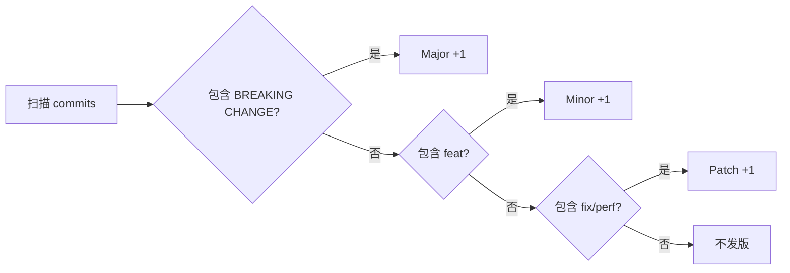

# 提交信息规范（Conventional Commits）

> 🇬🇧 [English Version](./CONTRIBUTING.md)

本项目遵循 [Conventional Commits](https://www.conventionalcommits.org/zh-hans/) 规范。  
该规范与 [Semantic Versioning (SemVer)](https://semver.org/lang/zh-CN/) 配合使用，可实现**自动化版本号管理**和**自动生成 CHANGELOG**。

---

## 1. 提交信息格式

```
<type>(<scope>): <subject>

<body>

<footer>
```

| 部分 | 是否必填 | 说明 |
|------|---------|------|
| `type` | ✅ 必填 | 提交类型，决定版本号变更方式 |
| `scope` | ⬜ 可选 | 影响范围（模块名），如 `parser`、`renderer`、`app` |
| `subject` | ✅ 必填 | 简短描述，不超过 72 个字符，**不加句号** |
| `body` | ⬜ 可选 | 详细说明，解释"为什么"和"怎么做" |
| `footer` | ⬜ 可选 | 关联 Issue、Breaking Change 说明等 |

---

## 2. Type 类型速查表

### 2.1 影响版本号的类型

| Type | 说明 | SemVer 影响 | 示例 |
|------|------|------------|------|
| `feat` | ✨ **新功能** | 升 Minor（x.**Y**.0） | 新增 Markdown 语法支持 |
| `fix` | 🐛 **Bug 修复** | 升 Patch（x.y.**Z**） | 修复解析器崩溃问题 |
| `perf` | ⚡ **性能优化** | 升 Patch（x.y.**Z**） | 优化流式解析性能 |

### 2.2 不影响版本号的类型

| Type | 说明 | 示例 |
|------|------|------|
| `docs` | 📝 文档变更 | 更新 README、PARSER_COVERAGE_ANALYSIS |
| `style` | 💄 代码格式（不影响逻辑） | 调整缩进、删除多余空行 |
| `refactor` | ♻️ 重构（既不修复 bug 也不新增功能） | 重构 InlineParser 架构 |
| `test` | ✅ 测试相关 | 新增单元测试、修复测试 |
| `build` | 🔧 构建系统/依赖变更 | 升级 Gradle、更新 Kotlin 版本 |
| `ci` | 👷 CI/CD 配置 | 修改 GitHub Actions workflow |
| `chore` | 🔨 其他杂项 | 更新 .gitignore、IDE 配置 |
| `revert` | ⏪ 回退提交 | 回退某次错误提交 |

### 2.3 Breaking Change（大版本升级）

在 footer 中添加 `BREAKING CHANGE:` 或在 type 后加 `!`，会触发 **Major 版本升级**（**X**.0.0）：

```
feat(parser)!: 重构 AST 节点结构

BREAKING CHANGE: MarkdownNode 接口签名发生变更，所有自定义节点需要适配新接口。
```

---

## 3. 各场景提交示例

### 3.1 ✨ 新功能（feat）

```bash
# 基本格式
git commit -m "feat(parser): 支持定义列表语法解析"

# 带 scope 的详细格式
git commit -m "feat(renderer): 实现表格渲染支持

支持 GFM 表格语法的完整渲染，包括左对齐、右对齐、
居中对齐和单元格内行内元素解析。

Closes #18"

# 多模块联动
git commit -m "feat: 支持告示块（Admonition）

- parser: 新增 BlockQuote → Admonition 转换逻辑
- renderer: 实现 NOTE/TIP/WARNING 等类型的样式渲染
- app: 添加告示块预览示例到 Demo 页面

Closes #25"
```

### 3.2 🐛 Bug 修复（fix）

```bash
# 基本格式
git commit -m "fix(parser): 修复嵌套块引用解析时的栈溢出问题"

# 带详细说明
git commit -m "fix(renderer): 修复行内代码在深色主题下不可见

行内代码背景色与深色主题背景色相近，导致文字不可见。
为不同主题模式分别设置对应的背景色和前景色。

Fixes #14"

# 修复构建问题
git commit -m "fix(build): Maven 仓库配置导致 Gradle 同步失败"
```

### 3.3 ⚡ 性能优化（perf）

```bash
git commit -m "perf(parser): 优化增量解析性能

稳定前缀块直接复用，尾部脏区域增量重解析，
大文档解析耗时降低约 40%。"

git commit -m "perf(renderer): 缓存 TextStyle 实例避免重复创建"
```

### 3.4 ♻️ 重构（refactor）

```bash
git commit -m "refactor(renderer): 将 InlineRenderer 解耦为独立模块"

git commit -m "refactor(parser): StreamingParser 改为 append-only 增量策略

将流式解析从全量重解析改为尾部增量解析，消除冗余的 AST 重建。"
```

### 3.5 📝 文档更新（docs）

```bash
git commit -m "docs: 更新 README 添加安装说明"

git commit -m "docs(parser): 更新 PARSER_COVERAGE_ANALYSIS 标记新支持的语法"
```

### 3.6 ✅ 测试（test）

```bash
git commit -m "test(parser): 为自定义容器语法添加单元测试"

git commit -m "test(renderer): 补充表格渲染的边界条件测试"
```

### 3.7 🔧 构建/依赖（build）

```bash
git commit -m "build: 升级 Kotlin 至 2.1.0"

git commit -m "build: 更新 Compose Multiplatform 至 1.7.3

同步更新 gradle.properties 和 libs.versions.toml。"
```

### 3.8 🔖 版本发布（chore/release）

```bash
git commit -m "chore(release): 发布 v1.3.0"

git commit -m "chore(release): 升级版本号至 1.2.5"
```

### 3.9 ⏪ 回退（revert）

```bash
git commit -m "revert: feat(parser): 支持定义列表语法解析

This reverts commit abc1234.
原因：该功能在 iOS 平台存在兼容性问题，需要进一步调研。"
```

---

## 4. Scope（影响范围）参考

本项目推荐使用以下 scope：

| Scope | 对应模块 | 说明 |
|-------|---------|------|
| `parser` | `markdown-parser` | Markdown 解析器（AST 生成） |
| `renderer` | `markdown-renderer` | 渲染引擎（AST → Compose UI） |
| `app` | `composeApp` | Compose Multiplatform Demo 应用 |
| `android` | `androidapp` | Android 独立应用 |
| `ios` | `iosApp` | iOS 应用 |
| `build` | 根项目构建 | Gradle 配置、依赖管理 |

> 如果变更跨多个模块，可以省略 scope，在 body 中说明各模块的变更。

---

## 5. 新功能开发规范

### 5.1 开发清单

开发新功能时，请自查以下清单：

- [ ] `markdown-parser` 中实现了解析逻辑
- [ ] `markdown-parser` 中添加了对应的单元测试（`commonTest`）
- [ ] `markdown-renderer` 中实现了渲染逻辑（如涉及渲染）
- [ ] `markdown-renderer` 中添加了对应的单元测试（如涉及渲染）
- [ ] 运行 `./gradlew allTests` 并全部通过
- [ ] `composeApp` 中添加了该功能的预览示例
- [ ] 更新 `markdown-parser/PARSER_COVERAGE_ANALYSIS.md` 支持列表

### 5.2 测试执行

```bash
# Parser 模块测试
./gradlew :markdown-parser:allTests

# Renderer 模块测试
./gradlew :markdown-renderer:allTests

# 全部测试
./gradlew allTests
```

- Gradle 任务退出代码必须为 `0`
- 控制台输出必须显示 "BUILD SUCCESSFUL"
- **严禁**在测试失败的情况下提交代码

### 5.3 测试编写规范

- **测试文件位置**：`<module>/src/commonTest/kotlin/com/hrm/markdown/...`
- **测试类名**：`FeatureNameTest`（如 `HeadingParserTest`、`TableRendererTest`）
- **测试方法**：`should_expectedBehavior_when_condition` 或清晰描述测试目的的命名
- **覆盖要求**：
  - ✅ 正常路径（Happy Path）
  - ✅ 边界条件（Edge Cases）：空输入、特殊字符、嵌套结构等
  - ✅ 错误处理（Error Handling）：非法输入优雅降级

---

## 6. MR（Merge Request）提交规范

### 6.1 MR 标题格式

MR 标题应遵循与 commit 相同的 Conventional Commits 格式：

```
<type>(<scope>): <简短描述>
```

**示例：**

| 场景 | MR 标题 |
|------|---------| 
| 新功能 | `feat(parser): 支持自定义容器语法` |
| Bug 修复 | `fix(renderer): 修复嵌套列表渲染缩进异常` |
| 性能优化 | `perf(parser): 优化大文档的增量解析性能` |
| 重构 | `refactor(renderer): 统一块级节点渲染路径` |
| 版本发布 | `chore(release): v1.3.0` |
| 多功能合并 | `feat: 支持告示块、脚注和定义列表` |

### 6.2 MR 描述模板

```markdown
## 变更说明
<!-- 简要描述本次 MR 做了什么 -->

## 变更类型
- [ ] ✨ 新功能 (feat)
- [ ] 🐛 Bug 修复 (fix)
- [ ] ♻️ 重构 (refactor)
- [ ] ⚡ 性能优化 (perf)
- [ ] 📝 文档 (docs)
- [ ] ✅ 测试 (test)
- [ ] 🔧 构建/CI (build/ci)

## 影响模块
- [ ] markdown-parser
- [ ] markdown-renderer
- [ ] composeApp
- [ ] androidapp / iosApp

## 自测清单
- [ ] `./gradlew allTests` 全部通过
- [ ] 新功能已添加对应的单元测试
- [ ] 预览示例已添加到 composeApp Demo 页面
- [ ] 在 Android / iOS / Desktop 至少一个平台验证渲染效果
- [ ] (如适用) 更新 PARSER_COVERAGE_ANALYSIS.md

## 关联 Issue
<!-- Closes #xxx 或 Fixes #xxx -->
```

---

## 7. 版本号与提交类型的对应关系

```
版本号格式：MAJOR.MINOR.PATCH（如 1.3.2）

提交类型          →  版本号变更          →  触发条件
─────────────────────────────────────────────────────
feat              →  1.2.0 → 1.3.0     →  新增功能
fix / perf        →  1.2.0 → 1.2.1     →  修复/优化
BREAKING CHANGE   →  1.2.0 → 2.0.0     →  不兼容变更
docs/style/test   →  不变更             →  不影响产物
```

### 版本号自动生成流程（Semantic Release）



---

## 8. 常见错误示例

```bash
# ❌ 没有 type
git commit -m "修复了一个 bug"

# ❌ type 后没有冒号和空格
git commit -m "feat修复解析器"

# ❌ subject 太模糊
git commit -m "fix: 修复了一些问题"

# ❌ 中英文混用 type
git commit -m "功能(parser): 支持新语法"

# ✅ 正确格式
git commit -m "fix(parser): 修复围栏代码块嵌套超过 3 层时的解析错误"
```

---

## 9. Git Hooks 自动校验（可选）

可以使用 [commitlint](https://commitlint.js.org/) 配合 git hooks 自动校验提交信息格式：

```bash
# 安装（Node.js 环境）
npm install --save-dev @commitlint/cli @commitlint/config-conventional

# 创建 commitlint.config.js
echo "module.exports = { extends: ['@commitlint/config-conventional'] };" > commitlint.config.js

# 配合 husky 设置 commit-msg hook
npx husky add .husky/commit-msg 'npx --no -- commitlint --edit "$1"'
```

---

## 10. 快速参考卡片

```
feat(scope): 新功能描述          → Minor 升版
fix(scope): 修复了什么问题        → Patch 升版
perf(scope): 优化了什么性能       → Patch 升版
refactor(scope): 重构了什么       → 不升版
docs(scope): 更新了什么文档       → 不升版
test(scope): 增加/修改了什么测试   → 不升版
build(scope): 构建/依赖变更       → 不升版
chore(release): vX.Y.Z          → 版本标记
feat(scope)!: xxx               → Major 升版（破坏性变更）
```
